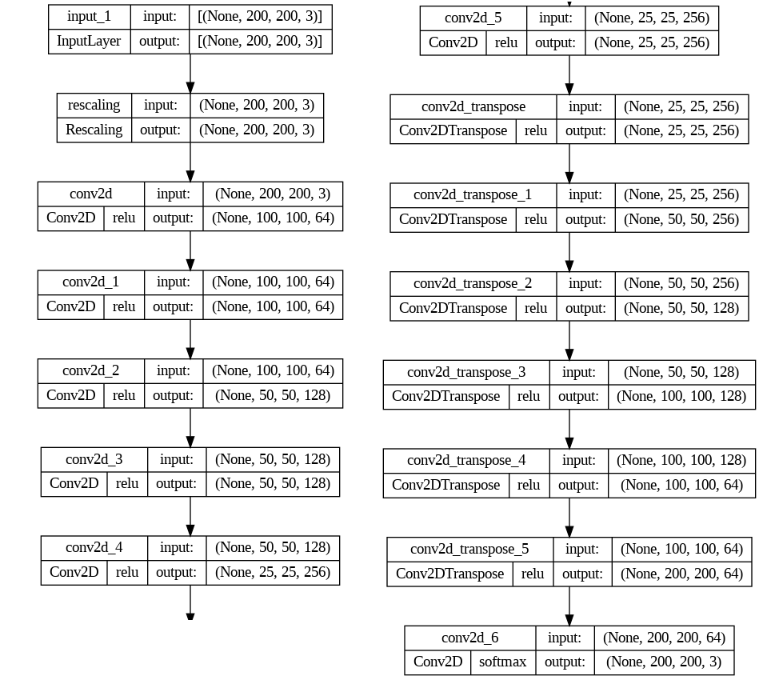
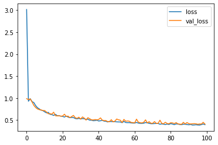
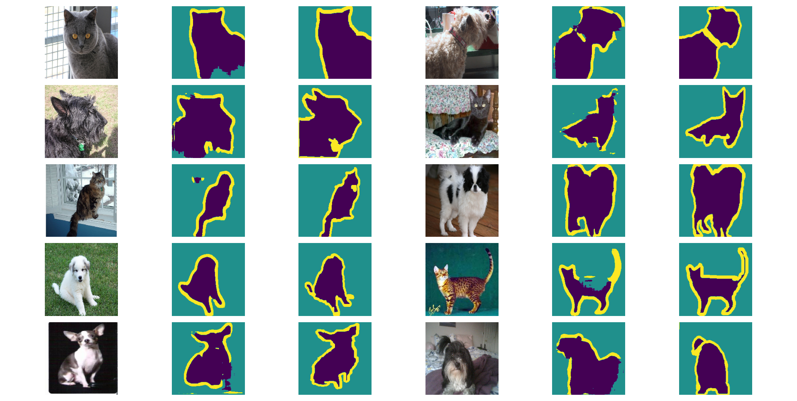
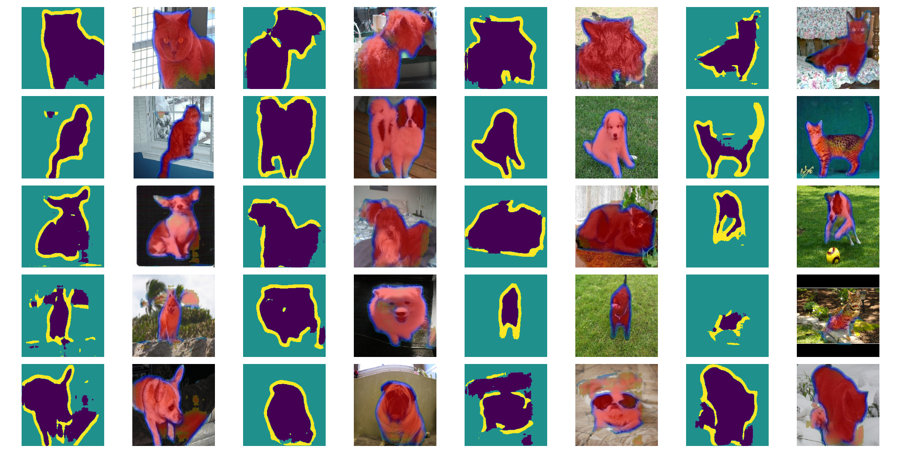
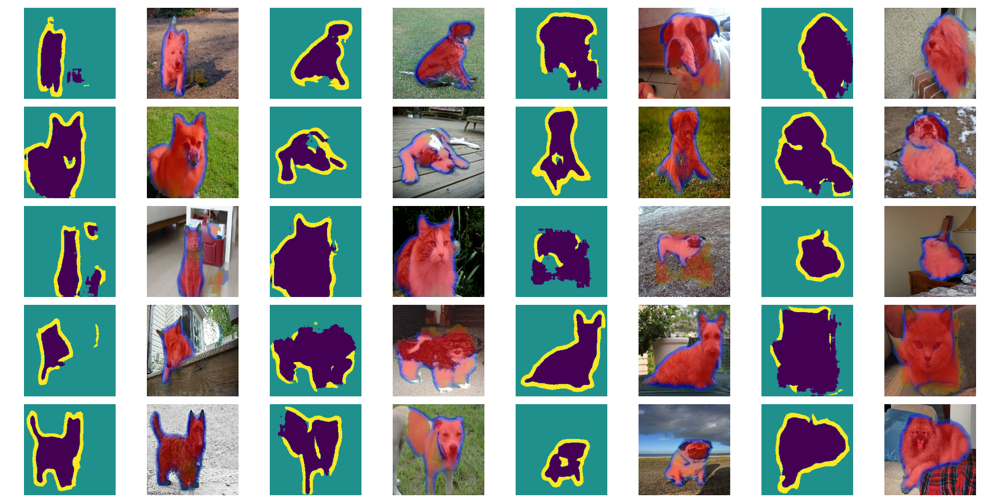

# Single-Object Semantic Segmentation

This repository is an exercise for the single-object semantic segmentation project on the Oxford-IIIT Pet Dataset.
The Oxford-IIIT Pet Dataset is a 37 category pet dataset with roughly 200 images for each class created by the Visual 
Geometry Group at Oxford. [[kaggle.com](https://www.robots.ox.ac.uk/~vgg/data/pets/)]

Original dataset was downloaded from [https://www.robots.ox.ac.uk/~vgg/data/pets/](https://www.robots.ox.ac.uk/~vgg/data/pets/).

## Training Process
In this project, an autoencoder network with thirteen convolutional layers, which has 2,880,643 parameters, is used for 
semantic segmentation of images with dimensions of 200 x 200 x 3.

To train this network, 5173 images have been used as training data and 2217 images as validation data.

The structure of the model is shown in the image below:
#### Single-Object Semantic Segmentation Model Structure


This network was trained in the Google colab environment and its final parameters were saved.
Its loss curves are shown in the following image:


## Usage
### Requirements
- python 3.9
- Tensorflow == 2.11.0
- pandas == 1.5.3
- numpy == 1.24.2
- matplotlib == 3.6.3
- keras~=2.11.0
- scikit-learn~=1.1.1

```python
import matplotlib.pyplot as plt
from keras.models import load_model
from Utils.data_prepair import stack_data
import matplotlib.pyplot as plt

model = load_model('model_regularization.h5')
prediction = model.predict(image)
image = stack_mask(prediction, image)
plt.imshow(image)
```

Examples of how this network works are given below:




## License
This repository is released under [Apache License V2](http://www.apache.org/licenses/LICENSE-2.0). To develop,
publication and use it, please follow the terms of this license.
